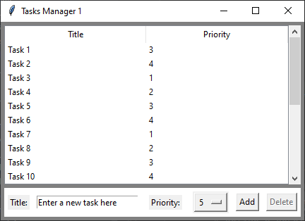
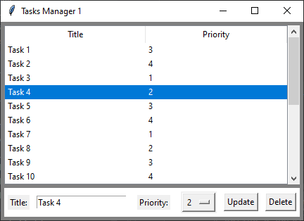
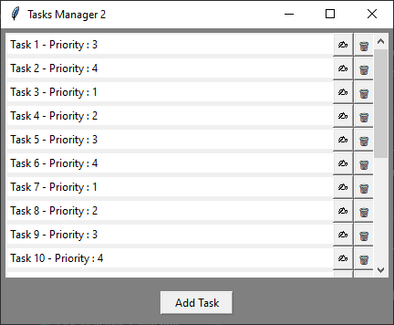
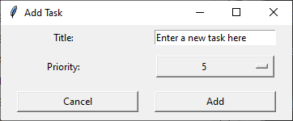
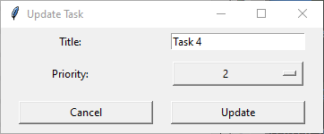
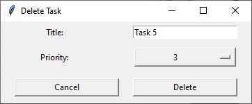

[Model-View Architectures](../README.md) > [No_Model](No_Model.md)

# 1. Without Model or View: 

Here is the **first step** of our progress along [Model-View Architectures](../README.md).

In this first scenario, there are **two separate programs** that **don't share data** or have any interaction.

They have the same purpose of managing tasks but present different ways of doing it.

* [Task Manager 1](#task-manager-1) : A version with a table of 2 columns.
* [Task Manager 2](#task-manager-2) : A version with list of lines and buttons.

---

## Task Manager 1

The first one defines a **table** with 2 columns ("Title" and "Priority") into a window using Treeview of the **Tkinter** 
library, and displays the tasks entered by the user. 

The user can enter a new task by clicking on the **"Add"** button after writing the **label** into the part below and 
defining a **priority** in the list menu. 

If a task is **selected** on the list, the user can update it or delete it by completing the information and clicking 
on the **corresponding button**. There is **no validation** and the program returns to the first view with the updated 
list.

---

## Task Manager 2

The second displays a **list of labels** indicating 2 values (the "Title" and the "Priority") followed by 2 buttons 
representing the **options to update or delete** the corresponding line, and a general button below to **add** a task 
at the end of the list.

The user can thus add another task by clicking on **"Add Task"** and completing the information,

   

 or select the correct option corresponding to the line to be modified.

     

The pop-ups indirectly set a **validation** to any step that can be cancelled, and then the program returns to the first 
view with the updated list.

---

## Demonstration

For demonstration purposes, the table and the list of these two programs are automatically filled in when they are 
launched. \
The data is not saved and remains in memory only until the program is closed.

This section only shows the two programs that will be used to demonstrate the integration of models and views. 
It's important to note that these programs do not share data and duplicate a part of the data logic, which is not 
recommended. 

Therefore, our next step will involve exploring how to incorporate a [Model](../2_Model/Model.md) into these two programs.

---

[Model-View Architectures](../README.md) > [No_Model](No_Model.md)    