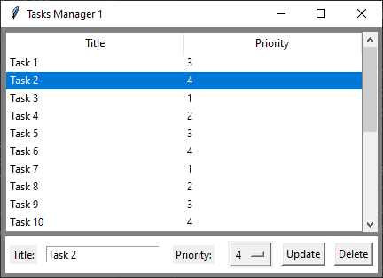
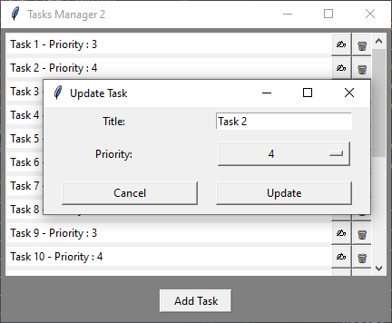

[Model-View Architectures](../README.md) > [2_Model](../2_Model/Model.md)

# 2. With a Model

In this scenario, we introduce a model that allows the two programs to share data and logic.

It's the **second step** of our progress along [Model-View Architectures](../README.md).

This section explains :

* [What is a Model and why generate one ?](#what-is-a-model-and-why-generate-one-)
* The [Generic models](#generic-models) generated for this application.
* The [Task CRUD Model](#task-crud-model) used in this application.
* The [File Observer](#file-observer) integrated to this application. 
* The [Modifications in Task Manager Applications](#modifications-in-task-manager-applications) to integrate them.  
 
---

## What is a Model and why generate one ?

In software architecture, the **“Model”** represents the data and the business logic of the application. \
It encapsulates the rules and operations related to the main functionalities of the application.

Separating the model from the rest of the application allows for a clear **distinction between data manipulation
and user interface issues**.

It develops a more **efficient teamwork** by allowing parts to be edited independently of the others. This makes it 
easier to **test**, **debug**, **evolve**, and **reuse the code**, improving maintainability and readability, and makes 
the **code clearer**, even if it is sometimes necessary to add components for integrating it.

---

## Generic models

In programming, data can be shared when **all parties know their structures and definitions**. But to simplify the 
coordination of these parties and improve the maintainability of the code, it is strongly encouraged to **extract** 
the data model from the main application and make it **independent**.

A **CRUD** model has been thus developed to provide the main data manipulation functionalities (**C**reate, **R**ead, 
**U**pdate, and **D**elete) to our programs.

Then, to facilitate the modifications within the applications, this model has been modified to become **generic**.

Finally, to illustrate how easily the **model can be swapped within the application**, four additional models have 
been developed and derived from the initial generic model. These models show how to realize a **potential storage** 
or an **integration of data** in different **files** or **databases** in order to **share** them with **other programs 
and applications**.

* ***Generic_CSV_CRUD_Model*** : suitable for CSV files
* ***Generic_JSON_CRUD_Model*** : suitable for JSON files
* ***Generic_XML_CRUD_Model*** : suitable for XML files
* ***Generic_SQLITE3_CRUD_Model*** : suitable for SQLITE3 databases

More about : [Generic_Models](../2_Model/Generic_Models/Generic_Models.md)

---

## Task CRUD Model

The **Task CRUD Model** can therefore be created super easily by defining a **Task** object with the wished arguments.

In this example, we used 3 arguments :
* *title* : string representing the label of the task
* *priority* : integer representing the value of priority referred to the task
* *modified_on* : datetime storing the last date and time of modification

which must matched with the self attributes of the ***\_\_init\_\_*** method 

```python
class Task:

    def __init__(self, title: str, priority: int, modified_on : datetime = datetime.now()):
        self.title: str = title
        self.priority: int = priority
        self.modified_on: datetime = modified_on
```

The **Task CRUD Model** must derive from **Generic_CRUD_Model** or from one of **its children** to work, 
and the ***\_\_init\_\_*** method must call the ***\_\_init\_\_*** of the model used with the **Task** object ... 

```python
class Task_CRUD_Model(Generic_CRUD_Model):
    
    def __init__(self, notify_function : Callable =None):
        super().__init__(Task, notify_function)
```
... and that's it ! **The model is created and modifiable !** Pretty cool, no ?!

### Modifiable model

The model can easily be modified by **swapping the class inherited** with any class derived from 
***Generic_CRUD_Model***.

Only the ***Generic_JSON_CRUD_Model*** requires an additional parameter on the ***Task*** class. To properly use the 
**generic JSON encoder and decoder**, it must inherit from the ***Json_Object_Meta metaclass*** but this does not 
affect the other models and can be used by default if wished.

More about : [Generic_Models](../2_Model/Generic_Models/Generic_Models.md)

### Specific format

For this application, I also override the ***read_format*** method in the ***Task*** class to customize the format of 
objects appearing in the list :  

```python
class Task:

    def read_format(self):
        return tuple(self.__dict__.values())
```

and decided that the argument ***modified_on*** in ***Task_CRUD_Model*** will be automatically updated at 
each modification to simplify the code in the application model, but it is not required to work correctly.

```python
class Task_CRUD_Model(Generic_CRUD_Model):

    def create(self, title: str, priority: int):
        super().create(title, priority, datetime.now())
    
    def update(self, list_idx: int, title: str, priority: int):
        # Includes the date and time of modification
        super().update(list_idx, title, priority, datetime.now())
```

---

## File Observer

You probably noticed that another argument is passed to the ***\_\_init\_\_*** method, a **Callable** function named 
***notify_function***.

This is a part of the **File Observer** pattern which allows for the applications and programs to be **notified** when 
the **file** or **database** is modified by another program.

More about : [Observer_patterns](../2_Model/Observer_patterns/Observer_patterns.md)


### The File Observer Handler within the Generic CRUD Model

The programs using a derived class of ***Generic_CRUD_Model*** with a ***file_extension*** argument, are automatically 
registered as **observer on the file they create or use** within the system and are **notified** each time this **file** 
is modified. 

The ***_on_file_modified*** method will thus be called each time the program receives a notification **from the system**.
             
```python
from watchdog.observers import Observer
from Observer_patterns.FileObserverHandler import FileObserverHandler

class Generic_CRUD_Model:

    def __init__(self, object_type: type, on_modified: Callable = None, file_extension: str = None):
        ...
        # If the use of a file is requested
        if file_extension is not None:
            ...
            self._on_file_modified = on_modified
            ...
            file_abspath = os.path.abspath(self.filename)
            self.file_observer_handler = FileObserverHandler(file_abspath, self._on_file_modified_checking_timestamp)
            
            self.file_observer = Observer()
            self.file_observer.schedule(self.file_observer_handler, path=os.path.dirname(file_abspath), recursive=False)
            self.file_observer.start()
    
            self.last_modified_timestamp = None  # Will be used to check if the file has been modified from outside
```

The ***last_modified_timestamp*** defines a **trigger** to know if the modification (notified by the system, therefore 
regardless of the application) comes from this program or from another one. 

The ***FileObserverHandler*** does not directly call the ***_on_file_modified*** method but the 
***_on_file_modified_checking_timestamp*** method instead to check which program made the last modification, and thus 
avoid the 'notification <==> modification' redundancy.

```python
class Generic_CRUD_Model:

    def _on_file_modified_checking_timestamp(self, *args, **kwargs) -> None:
        
        if self.filename:
            ...            
            # Check if the timestamp of the last modification is the same that the one we already got
            current_timestamp = os.path.getmtime(self.filename)
            creation_timestamp = os.path.getctime(self.filename)
        
            if current_timestamp != self.last_modified_timestamp and current_timestamp != creation_timestamp:
                if self._on_file_modified is not None :
                    self._on_file_modified(self, *args, **kwargs)
```

At the end of the program, the ***stop*** method of the ***file_observer*** is also called to remove this program from 
the **file observer list** of the system.

```python
class Generic_CRUD_Model:

    def __del__(self) -> None:
        if self.file_observer:
            self.file_observer.stop()    # Remove the observer from FileSystemEventHandler
            self.file_observer.join()    # Wait for the end of the thread
       if self.file_observer_handler:
            self.file_observer_handler.stop()  # Stop the observer handler
```

---

## Modifications in Task Manager Applications

### Integration of the Task_CRUD_Model

In ***Task Manager 1***, the data was directly manipulated through a ***TreeView*** object, whereas it is managed  
through the task ***list*** in ***Task Manager 2***. 

Now the ***tasks*** object is defined as ***Task_CRUD_Model*** and can be used to ***create***, ***read***, 
***update*** and ***delete*** tasks from/to the internal list of this **shared** class. 

```python
from Task_CRUD_Model import Task_CRUD_Model
...
class Task_Manager_1:
    
    def __init__(self, fill_the_list: bool = True):
        ...
        self.tasks = Task_CRUD_Model(self.notify_on_file_modified)      # Create a connection to the Model
        ...
    ...
    def notify_on_file_modified(self, *args, **kwargs):
        """ Called when the file/db is modified by another process """
            # The 'after' method from Tkinter library is employed to initiate the refresh within the main thread.
            # This setup is particularly requested when the system called this method to notify the application
            # about an external modification, especially when dealing with SQLITE3 files.
            self.window.after(0, self.refresh)
```

A ***notify_on_file_modified*** method is used as callback to handle the notifications is received from the system when
a modification is operated in the model file defined by the ***Task_CRUD_Model***.

This one calls the respective ***refresh*** method of the ***Task Manager*** and uses the ***after*** method, 
provided by the ***tkinter*** library to schedule its execution from at some point later in the ***main*** thread. 
This is particularly required for the model using ***SQLITE3***.

### Refresh Method



In ***Task_Manager_1***, the ***refresh*** method calls an ***update_tasks_from_model*** method, which clear all 
the current lines of the tree before reinserting them using the ***read*** method of the model.

Then it calls a ***clear_selection_and_input_fields*** method to clear any potential selections made on the list with 
the mouse, and refresh the default values in the frame at the bottom of the window.

```python
class Task_Manager_1:

    def update_tasks_from_model(self):
        self.tree.delete(*self.tree.get_children())
        for task in self.tasks.read():
            self.tree.insert("", tk.END, values=task, tags=task)
    
    def refresh(self, *args, **kwargs):
        self.update_tasks_from_model()
        self.clear_selection_and_input_fields()
```



In ***Task_Manager_2***, the same-named ***update_tasks_from_model*** method is called to update the list by simply 
copying the elements of the ***read*** method, then a ***clear_pop_up_and_input_fields*** method is called to refresh 
the frame list and reset the scrollbar region according to this new list.

```python
class Task_Manager_2:

    def update_tasks_from_model(self):
        self.tasks_list = self.tasks.read()
    
    def refresh(self, *args, **kwargs):
        """ Called when the file/db is modified by another process """
        self.update_tasks_from_model()
        self.clear_pop_up_and_input_fields()
```

### Add / Update / Delete Buttons

* The '***Add***' button now calls the ***create*** method of the ***Task_CRUD_Model***
* The '***Update***' or '✍' buttons calls the ***update*** method 
* and the '***Delete***' or '🗑' buttons calls the ***delete*** method
 
Then they also call the ***refresh*** method but this time directly because it is done from the main thread.

---
[Model-View Architectures](../README.md) > [2_Model](../2_Model/Model.md)
