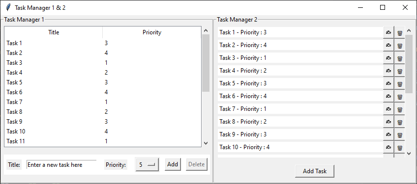

[Model-View Architectures](../README.md) > [3_Model_View](../3_Model_View/Model_View.md)

# 3. With a Model View

In the previous scenario we introduced the [Model](../2_Model/Model.md). Now, we are going to introduce views that allow the two programs 
to share data and logic under different user interfaces in the same program.

It's the **third step** of our progression into the [Model-View Architectures](../README.md).

This section explains :

* [What is a View and why generate one ?](#what-is-a-view-and-why-generate-one-)
* The [Modifications in Generic models](#modifications-in-generic-models), generated for this application.
* The [Modifications in Task CRUD Model](#modifications-in-task-crud-model), used by this application.
* And the [Modifications in the Task Manager Applications](#modifications-in-the-task-manager-applications).  
 
---

## What is a View and why generate one ?

In software architecture, a **View** represents the **presentation layer** of an application. 
It provides an **interface** for users to interact with application data and functionality.

Separating the view from the rest of the application allows for a clear **distinction between the user interface and 
the application's features and data**.

It becomes **easier to modify** the user interface without affecting the core functionality of the application, 
and so **easier to test, debug, enhance, and reuse the code**, improving maintainability and readability.

---

## Modifications in Generic models

The ***tkinter*** Python library allows different views but requires **a single *Tk* instance**, so this one has been 
removed from the **Task Managers** to be implemented in the **main** program.
    
Due to these **specificities**, the ***file_observer*** also requested to be configured to run in a **separate thread** 
in order to notify the different views or windows when a modification appears **outside the application scope**. 

Then, an additional **Observer pattern** has been implemented to make the **Generic models** as ***Observable***, and 
thus allows the different views or windows to be notified when one of them make a data modification, meaning
**inside the application scope**. 

More about : [Generic_Models](../3_Model_View/Generic_Models/Generic_Models.md#observable-class-inheritance)

---

## Modifications in Task CRUD Model

Simple, no one !

Only the **Usage Example** has been modified to show how to make a model observed by different users.

More about : [Generic_Models](../3_Model_View/Generic_Models/Generic_Models.md#usage-example-updated)

---

## Modifications in the Task Manager Applications

### Sharing the root window instance

Following the recommendations of the [tkinter documentation](https://docs.python.org/3/library/tkinter.html)

> While ***tkinter*** allows you to create more than one instance of a Tk object (with its own interpreter), 
> all interpreters that are part of the same thread share a common event queue, which gets ugly fast. 
> **In practice, don’t create more than one instance of Tk at a time**.

I considered that it would be more aesthetic to have **different views in a single window** than 
**different windows launched by the same program**. So, the call to the ***Tk*** method, which creates the main window, 
was extracted from the ***Task_Manager* classes** to be placed in the ***main*** part, like the ***Task_CRUD_Model***, 
and the ***Task_Manager* classes** became **frames** to display in this **window**.

```python
if __name__ == "__main__":

    window = tk.Tk()
```

As a result, the ***Task_Manager*** classes now requires two essential parameters, ***window*** and ***task_model***, 
during their initialization. The ***window*** parameter serves as master for their graphical frame, while the 
***task_model*** is retained for data operations. 

---

### Registering views as observers

Additionally, they register themselves as **observers** for this model, enabling them to receive notifications 
about any modifications made **within the application**. 

```python
class Task_Manager_1:

    def __init__(self, window, task_model, fill_the_list: bool = True):
        ...
        self.window = window
        self.tasks = task_model
        self.tasks.add_observer(self.notify)  # Ask to be notified on modification
        self.notify_refresh = False
        ...
        # TK imposes a single root window (Tk instance), the display has thus been modified to appear in a frame
        self.tasks_manager_1_frame = tk.LabelFrame(self.window, text="Task Manager 1", labelanchor='nw')
        self.tasks_manager_1_frame.pack(side="left", fill=tk.BOTH, expand=True)
```
---

### Setting up the shared model

The ***Task_CRUD_Model*** has also been displaced to the ***main*** part to be shared within the application.
It still uses a ***notify*** function, named ***file_modified***, as a parameter in its initialization which takes
a method to call when the data file is modified.

And because this ***file_modified*** function invokes a method within the ***task_manager*** objects before its creation, 
it's essential to check for the existence of ***task_manager*** objects before employing it.

```python
if __name__ == "__main__":
    ...
    def file_modified(*args, **kwargs):
        if task_manager_1:
            task_manager_1.notify(*args, **kwargs)

    task_model = Task_CRUD_Model(file_modified)  # Create a connection to the Model

    task_manager_1 = Task_Manager_1(window, task_model)
```

Initially, this function was named '***notify_on_file_modified***'. But because the ***Task_CRUD_Model*** registers 
itself as an **observer**, and must define a ***notify*** method, it has been judicious to merge the two functions 
into a single one named '***notify***'.

---

### Optimizing the refresh calls

A switching mechanism is also introduced to prevent multiple consecutive refresh requests, which can occur during 
successive creations. It simply triggers the ***notify_refresh*** boolean and run the refresh if it's not already done.

In ***Task Manager 1*** :
```python
class Task_Manager_1:
    ...
    def refresh(self, *args, **kwargs):
        if hasattr(self, 'tree') and self.refresh_pending is False:
            self.update_tasks_from_model()
            self.clear_selection_and_input_fields()
            self.notify_refresh = False

    def notify(self, *args, **kwargs):
        """ Called when the file/db is modified by another process and when the data is modified by another view """
        if self.notify_refresh is False:
            self.notify_refresh = True
            # The 'after' method from Tkinter library is employed to initiate the refresh within the main thread.
            # This setup is particularly requested when the system called this method to notify the application
            # about an external modification, especially when dealing with SQLITE3 files.
            self.window.after(0, self.refresh)
```

In ***Task Manager 2*** :
```python
class Task_Manager_2:
    ...
    def refresh(self, *args, **kwargs):
        self.update_tasks_from_model()
        self.clear_pop_up_and_input_fields()
        self.notify_refresh = False

    def notify(self, *args, **kwargs):
        """ Called when the file/db is modified by another process and when the data is modified by another view """
        if self.notify_refresh is False:
            self.notify_refresh = True
            # The 'after' method from Tkinter library is employed to initiate the refresh within the main thread.
            # This setup is particularly requested when the system called this method to notify the application
            # about an external modification, especially when dealing with SQLITE3 files.
            self.window.after(0, self.refresh)
```
---

### Simplifying the refresh calls

Finally, since the ***notify*** method is invoked from the ***Generic_CRUD_Model*** whenever a data modification occurs, 
there is no longer the need to explicitly ***refresh*** the views.

The ***refresh*** calls have thus been removed from the task creation, update and deletion methods within the 
***Task Manager*** classes.

---

## Integration of views in the same program

Now, the 2 Task Managers can easily be created in the same program and share the same data file or database.

Here is the ***Task Manager 3*** combining the Task Manager 1 & 2 :



````python
import tkinter as tk

from Task_CRUD_Model import Task_CRUD_Model
from Task_Manager_1 import Task_Manager_1
from Task_Manager_2 import Task_Manager_2


if __name__ == "__main__":

    task_manager_1 = None
    task_manager_2 = None

    # TK allows different views but requests a single Tk instance
    window = tk.Tk()
    window.title("Task Manager 1 & 2")
    window.config(background="grey")
    window.minsize(width=430, height=280)

    def file_modified(*args, **kwargs):
        """ Called when the file is modified """
        if task_manager_1:
            task_manager_1.notify(*args, **kwargs)
        if task_manager_2:
            task_manager_2.notify(*args, **kwargs)

    task_model = Task_CRUD_Model(file_modified)  # Create a connection to the Model

    # Fill the list for demonstration purpose
    for i in range(20):
        task_model.create(f"Task {i + 1}", (i + 2) % 4 + 1)
    ###

    task_manager_1 = Task_Manager_1(window, task_model, False)
    task_manager_2 = Task_Manager_2(window, task_model, False)

    task_manager_2.run()
    task_manager_1.run()
````
---

But you are right, the step of separating the view from the rest of the application has not been fully implemented.

Let us therefore continue with the notion of [View Controller](../4_Model_View_Controller/Model_View_Controller.md).

---
[Model-View Architectures](../README.md) > [3_Model_View](../3_Model_View/Model_View.md)