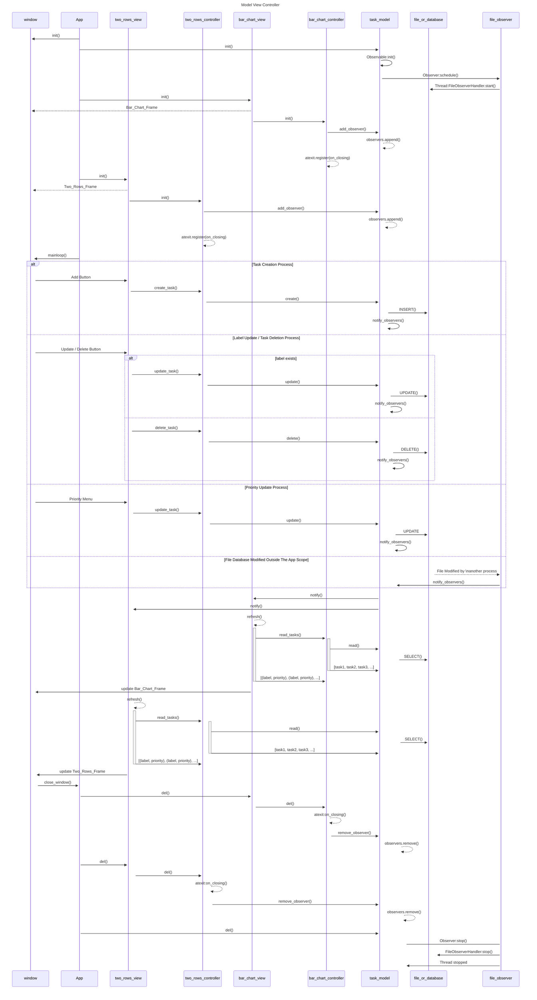

```mermaid
%%{init: { "theme": "default" } }%%
sequenceDiagram        
    title Model View Controller
    
    participant window
    participant App
    participant two_rows_view
    participant two_rows_controller
    participant bar_chart_view
    participant bar_chart_controller
    participant task_model
    participant file_or_database
    participant file_observer
    
    # Initialization Process 

    App ->>+ window : init()
    App ->>+ task_model : init()
    task_model ->>+ task_model : Observable:init()
    task_model ->>+ file_observer : Observer:schedule()
    file_observer ->>+ file_or_database : Thread:FileObserverHandler.start()
    
    App ->>+ bar_chart_view : init()
    bar_chart_view -->>+ window : Bar_Chart_Frame
    bar_chart_view ->>+ bar_chart_controller : init()
    bar_chart_controller ->>+ task_model : add_observer()
    task_model -->>+ task_model : observers.append()
    bar_chart_controller -->>+ bar_chart_controller : atexit.register(on_closing)
    
    App ->>+ two_rows_view : init()
    two_rows_view -->>+ window : Two_Rows_Frame
    two_rows_view ->>+ two_rows_controller : init()
    two_rows_controller ->>+ task_model : add_observer()
    task_model -->>+ task_model : observers.append()
    two_rows_controller -->>+ two_rows_controller : atexit.register(on_closing)
    App ->>+ window : mainloop()
    
    alt Task Creation Process
        window ->>+ two_rows_view : Add Button
        two_rows_view ->>+ two_rows_controller : create_task()
        two_rows_controller ->>+ task_model : create()
        task_model ->>+ file_or_database : INSERT()
        task_model ->>+ task_model : notify_observers()
        
    else Label Update / Task Deletion Process
        window ->>+ two_rows_view : Update / Delete Button
        alt label exists
            two_rows_view ->>+ two_rows_controller : update_task()
            two_rows_controller ->>+ task_model : update()
            task_model ->>+ file_or_database : UPDATE()
            task_model ->>+ task_model : notify_observers()
        else
            two_rows_view ->>+ two_rows_controller : delete_task()
            two_rows_controller ->>+ task_model : delete()
            task_model ->>+ file_or_database : DELETE()
            task_model ->>+ task_model : notify_observers()
        end
        
    else Priority Update Process
        window ->>+ two_rows_view : Priority Menu
        two_rows_view ->>+ two_rows_controller : update_task()
        two_rows_controller ->>+ task_model : update()
        task_model ->>+ file_or_database : UPDATE
        task_model ->>+ task_model : notify_observers()
        
    else File Database Modified Outside The App Scope
        file_or_database -->>+ file_observer : File Modified by \nanother process
        file_observer ->>+ task_model : notify_observers()
        
    end

    # Notifications and Refresh Processes
    task_model ->>+ bar_chart_view : notify()
    task_model ->>+ two_rows_view : notify()
    
    bar_chart_view -->>+ bar_chart_view : refresh()
    bar_chart_view ->>+ bar_chart_controller : read_tasks()
    bar_chart_controller ->>+ task_model : read()
    task_model ->>+ file_or_database : SELECT()
    bar_chart_controller ->>- task_model : [task1, task2, task3, ...]
    bar_chart_view ->>- bar_chart_controller : [(label, priority), (label, priority), ...]
    bar_chart_view ->>+ window : update Bar_Chart_Frame
    
    two_rows_view -->>+ two_rows_view : refresh()
    two_rows_view ->>+ two_rows_controller : read_tasks()
    two_rows_controller ->>+ task_model : read()
    task_model ->>+ file_or_database : SELECT()
    two_rows_controller ->>- task_model : [task1, task2, task3, ...]
    two_rows_view ->>- two_rows_controller : [(label, priority), (label, priority), ...]
    two_rows_view ->>+ window : update Two_Rows_Frame
    
    # Closing Process
    window ->>+ App : close_window()
    App ->>+ bar_chart_view : del()
    bar_chart_view ->>+ bar_chart_controller : del()
    bar_chart_controller -->>+ bar_chart_controller : atexit:on_closing()
    bar_chart_controller ->>+ task_model : remove_observer()
    task_model -->>+ task_model : observers.remove()
    
    App ->>+ two_rows_view : del()
    two_rows_view ->>+ two_rows_controller : del()
    two_rows_controller -->>+ two_rows_controller : atexit:on_closing()
    two_rows_controller ->>+ task_model : remove_observer()
    task_model -->>+ task_model : observers.remove()
    
    App ->>+ task_model : del()
    task_model -> file_observer : Observer:stop()
    file_observer ->>+ file_or_database : FileObserverHandler:stop()
    file_observer ->>+ task_model : Thread stopped
        
```