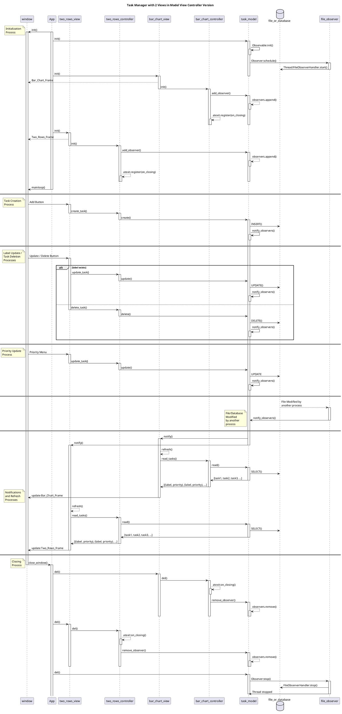

```plantuml:md-sample-sequence
@startuml

title Task Manager with 2 Views in Model View Controller Version

participant window
participant App
participant two_rows_view
participant two_rows_controller
participant bar_chart_view
participant bar_chart_controller
participant task_model
database file_or_database
participant file_observer

' Initialization Process
App -> window : init()
activate App
note left : Initialization \nProcess
activate window
App -> task_model : init()
activate task_model
task_model -> task_model : Observable:init()
activate task_model
deactivate task_model
task_model -> file_observer : Observer:schedule()
activate file_observer
file_observer -> file_or_database : Thread:FileObserverHandler.start()
deactivate file_observer

App -> bar_chart_view : init()
deactivate task_model
activate bar_chart_view
bar_chart_view --> window : Bar_Chart_Frame
bar_chart_view -> bar_chart_controller : init()
deactivate bar_chart_view
activate bar_chart_controller
bar_chart_controller -> task_model : add_observer()
activate task_model
task_model --> task_model : observers.append()
activate task_model
deactivate task_model
bar_chart_controller --> bar_chart_controller : atexit.register(on_closing)
activate bar_chart_controller
deactivate task_model
deactivate bar_chart_controller
deactivate bar_chart_controller

App -> two_rows_view : init()
activate two_rows_view
two_rows_view --> window : Two_Rows_Frame
two_rows_view -> two_rows_controller : init()
deactivate two_rows_view
activate two_rows_controller
two_rows_controller -> task_model : add_observer()
activate task_model
task_model --> task_model : observers.append()
activate task_model
deactivate task_model
two_rows_controller --> two_rows_controller : atexit.register(on_closing)
activate two_rows_controller
deactivate two_rows_controller
deactivate task_model
deactivate two_rows_controller
App -> window : mainloop()
deactivate App

====
' Task Creation Process
window -> two_rows_view : Add Button
note left : Task Creation \nProcess
deactivate task_model
activate two_rows_view
two_rows_view -> two_rows_controller : create_task()
deactivate two_rows_view
activate two_rows_controller
two_rows_controller -> task_model : create()
deactivate two_rows_controller
activate task_model
task_model -> file_or_database : INSERT()
task_model -> task_model : notify_observers()
activate task_model
deactivate task_model

====
' Label Update / Task Deletion Process
window -> two_rows_view : Update / Delete Button
note left : Label Update /\nTask Deletion \nProcesses
activate two_rows_view
alt label exists
two_rows_view -> two_rows_controller : update_task()
activate two_rows_controller
two_rows_controller -> task_model : update()
deactivate two_rows_controller
task_model -> file_or_database : UPDATE()
task_model -> task_model : notify_observers()
activate task_model
deactivate task_model
else
two_rows_view -> two_rows_controller : delete_task()
deactivate two_rows_view
activate two_rows_controller
two_rows_controller -> task_model : delete()
deactivate two_rows_controller
task_model -> file_or_database : DELETE()
task_model -> task_model : notify_observers()
activate task_model
deactivate task_model
end

====
' Priority Update Process
window -> two_rows_view : Priority Menu
note left : Priority Update \nProcess
activate two_rows_view
two_rows_view -> two_rows_controller : update_task()
deactivate two_rows_view
activate two_rows_controller
two_rows_controller -> task_model : update()
deactivate two_rows_controller
task_model -> file_or_database : UPDATE
task_model -> task_model : notify_observers()
activate task_model
deactivate task_model

====
' File Database Modified Outside The App Scope
file_or_database --> file_observer : File Modified by \nanother process
activate file_observer
file_observer -> task_model : notify_observers()
deactivate file_observer
note left : File/Database \nModified \nby another \nprocess

====
' Notifications and Refresh Processes
task_model -> bar_chart_view : notify()
activate bar_chart_view
task_model -> two_rows_view : notify()
deactivate task_model
activate two_rows_view

bar_chart_view --> bar_chart_view : refresh()
bar_chart_view -> bar_chart_controller : read_tasks()
activate bar_chart_controller
bar_chart_controller -> task_model : read()
activate task_model
task_model -> file_or_database : SELECT()
bar_chart_controller <- task_model : [task1, task2, task3, ...]
deactivate task_model
bar_chart_view <- bar_chart_controller : [(label, priority), (label, priority), ...]
deactivate bar_chart_controller
bar_chart_view -> window : update Bar_Chart_Frame
deactivate bar_chart_view
note left : Notifications \nand Refresh \nProcesses

two_rows_view --> two_rows_view : refresh()
two_rows_view -> two_rows_controller : read_tasks()
activate two_rows_controller
two_rows_controller -> task_model : read()
activate task_model
task_model -> file_or_database : SELECT()
two_rows_controller <- task_model : [task1, task2, task3, ...]
deactivate task_model
two_rows_view <- two_rows_controller : [(label, priority), (label, priority), ...]
deactivate two_rows_controller
two_rows_view -> window : update Two_Rows_Frame
deactivate two_rows_view

====
' Closing Process
window -> App : close_window()
note left : Closing \nProcess
deactivate window
activate App
App -> bar_chart_view : del()
activate bar_chart_view
bar_chart_view -> bar_chart_controller : del()
activate bar_chart_controller
bar_chart_controller --> bar_chart_controller : atexit:on_closing()
activate bar_chart_controller
deactivate bar_chart_controller
bar_chart_controller -> task_model : remove_observer()
activate task_model
task_model --> task_model : observers.remove()
activate task_model
deactivate task_model
deactivate task_model
deactivate bar_chart_controller
deactivate bar_chart_view

App -> two_rows_view : del()
activate two_rows_view
two_rows_view -> two_rows_controller : del()
activate two_rows_controller
two_rows_controller --> two_rows_controller : atexit:on_closing()
activate two_rows_controller
deactivate two_rows_controller
two_rows_controller -> task_model : remove_observer()
activate task_model
task_model --> task_model : observers.remove()
activate task_model
deactivate task_model
deactivate task_model
deactivate two_rows_controller
deactivate two_rows_view

App -> task_model : del()
activate task_model
task_model -> file_observer : Observer:stop()
activate file_observer
file_observer -> file_or_database : FileObserverHandler:stop()
file_observer -> task_model : Thread stopped
deactivate file_observer
deactivate task_model

@enduml
```

