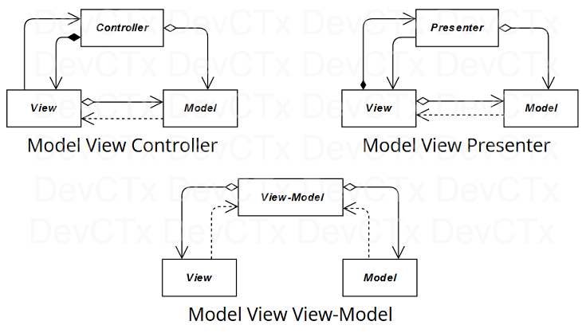

# [Model-View Architectures](README.md)

Understanding the objectives and benefits of the main Model-View architectures may be challenging, 
especially when they are represented in their simplest forms, widely distributed on the internet.

---

They nonetheless have their own characteristics and often result from a certain logical progression when we take a 
closer look.

The objective of this repository is thus to provide some examples to facilitate this understanding and highlight the 
distinctions between the 3 major Model-View architectures :
* **Model-View-Controller (MVC)**
* **Model-View-Presenter (MVP)**
* **Model-View-View-Model (MVVM)**

But, before digging into their specifics, it may be useful to remind the advantages of using a **Model** and **Views**.

That's why the firsts folders will explore simple Task Manager applications in different contexts and the next ones 
their migrations into these architecture patterns :

1. [Without Model or View](1_No_Model/No_Model.md) (as 2 separate programs)
2. [With a Model](2_Model/Model.md) (a shared data mechanism in 2 separate programs)
3. [With a Model and Views](3_Model_View/Model_View.md) (a shared data mechanism but in a single program)

4. [With Model-View-Controller (MVC)]
5. [With Model-View-Presenter (MVP)]
6. [With Model-View-View-Model (MVVM)]
 
---

[Model-View Architectures](README.md)